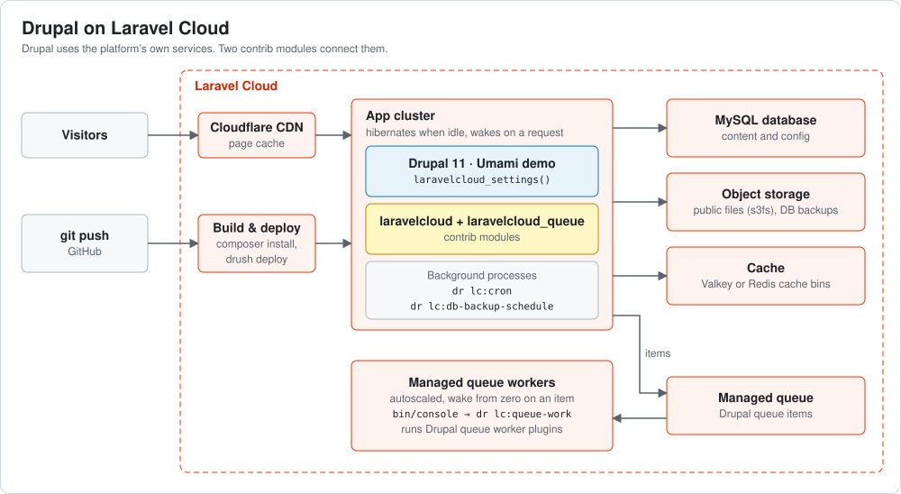
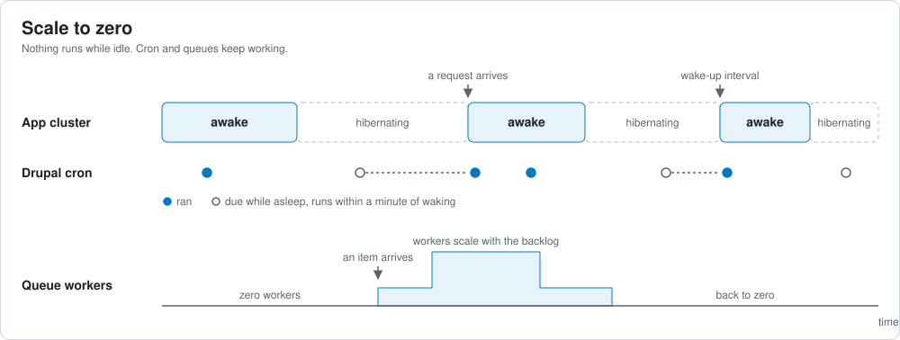
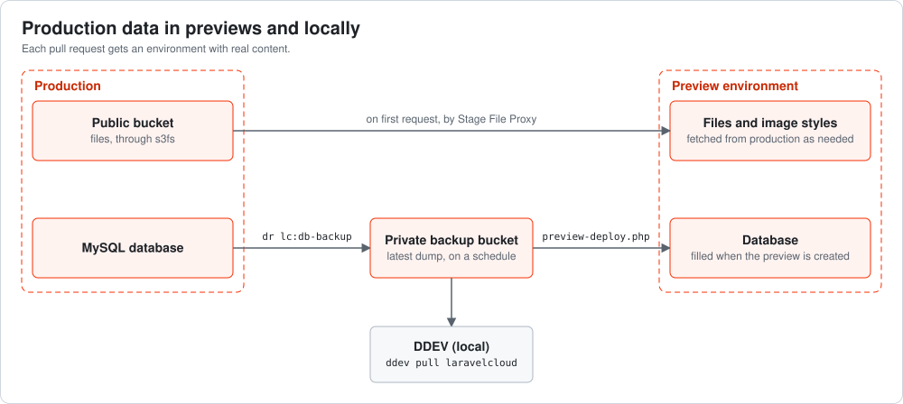
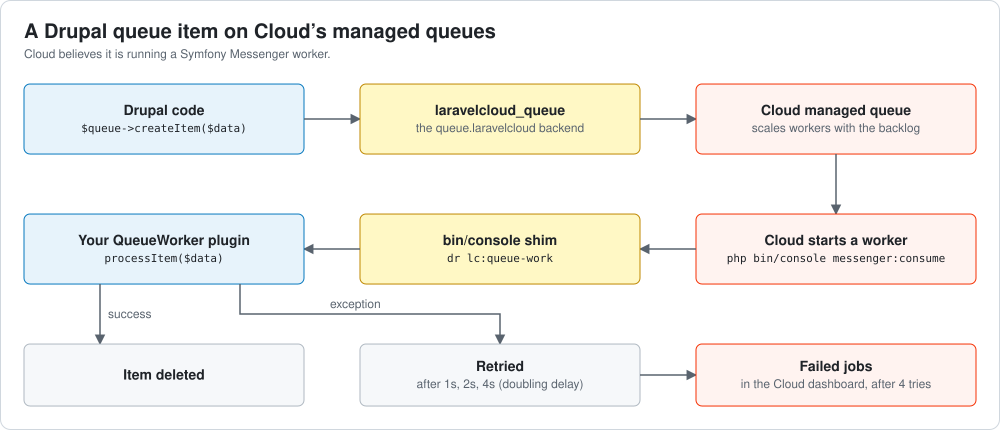

# Drupal on Laravel Cloud

A [working Drupal 11 site](https://drupalonlaravelcloud.cyrve.com/) hosted on [Laravel Cloud](https://cloud.laravel.com).
It is Drupal's Umami demo, deployed the way Cloud deploys a Laravel or Symfony
app: push to Git, Cloud builds and deploys.

The site uses Cloud's own database, object
storage, managed queues, background processes, CDN cache (Cloudflare) and preview environments.

Laravel Cloud's scale to zero functionality positions it as highly capable AND highly affordable.



## What it does

- **Git push deploys.** Cloud runs `composer install`, then the module's
  `deploy.php`, which runs `drush deploy`
  (database updates, config import, cache rebuild).
- **Zero hosting config in `settings.php`.** One function call reads the
  database, hash salt, site URL, reverse proxy and file storage from Cloud's
  environment variables. See
  [settings.php](web/sites/default/settings.php).
- **Scale to zero.** The App cluster hibernates when idle and wakes on the
  next request. Cron and queues keep working.
- **Cron without a crontab.** A Cloud background process runs Drupal cron on
  the schedule in `DRUPAL_CRON_SCHEDULE`. A sleeping environment catches up
  within a minute of waking.
- **Queues on Cloud's managed queues.** Drupal queue items go to Cloud's
  managed workers, which scale with the backlog and wake from zero when an
  item arrives. Failed items show up under failed jobs in the Cloud
  dashboard, named by their Drupal queue.
- **Files in object storage.** Instances have no persistent disk, so public
  files live in a Cloud bucket through
  [S3 File System](https://www.drupal.org/project/s3fs).
- **Preview environments with real content.** Each pull request gets its own
  environment. Its database is filled from the latest production backup, and
  its files are fetched from the production bucket on first request. Image
styles work too: the original is fetched and the derivative is generated on
the preview.
- **Database backups.** Production uploads a fresh dump to a private bucket
  on the schedule in `DB_BACKUP_SCHEDULE`, for previews and CI.
- **Production data locally.** `ddev pull laravelcloud` loads the latest
  database backup into [DDEV](https://ddev.com), through the
  [ddev-laravelcloud](https://github.com/weitzman/ddev-laravelcloud) add-on.





## The two modules

Everything above rests on two contrib modules written for this project. The
site itself adds almost nothing: two lines in `settings.php`, a `public`
symlink and a copied `bin/console`.

### [Laravel Cloud](https://www.drupal.org/project/laravelcloud)

This module is why a Drupal site can be dropped onto Cloud without a hosting
layer of its own.

- `laravelcloud_settings()` replaces the block of environment-sniffing code
  every hosted Drupal site accumulates. It does nothing off Cloud, so the same
  `settings.php` runs locally.
- `dr lc:cron` gives Drupal a scheduler on a platform that has none for it,
  and handles scale to zero, which most cron setups do not.
- `dr lc:db-backup` and `preview-deploy.php` together turn Cloud's empty
  preview environments into copies of production. A preview with no backup
  available installs from config (if available) instead, so it always comes
  up.
- It is small, has no admin UI to configure, and ships unit, kernel and
  build tests.

### [Laravel Cloud Queue](https://www.drupal.org/project/laravelcloud_queue)

This module gives Drupal something rare: queue workers that are managed,
autoscaled and observable by the platform, with no worker process of your own
to supervise.

- It is a standard Drupal queue backend. Existing queue worker plugins run
  unchanged; you select it with one setting.
- Cloud believes it is starting a Symfony Messenger worker. The module's
  `bin/console` shim hands that call to `dr lc:queue-work`, so Cloud's
  autoscaling, wake-on-message and dashboard all apply to Drupal queues.
- Failed items retry with a doubling delay, then land in Cloud's failed jobs
  list. Drupal's `RequeueException`, `DelayedRequeueException` and
  `SuspendQueueException` behave as their authors intended.
- Drupal queues can be mapped to separate managed queues, each with its own
  workers.



## Get this demo running in your own Cloud application

1. Fork this repo.
2. Sign up at [cloud.laravel.com](https://cloud.laravel.com) and create an
   application from the fork. See the
   [Cloud docs](https://cloud.laravel.com/docs). Cloud detects a Symfony
   app, generates `APP_SECRET` (the hash salt) and fills in the build
   command.
3. Attach a
   [MySQL database](https://cloud.laravel.com/docs/resources/databases), a
   public [bucket](https://cloud.laravel.com/docs/resources/object-storage)
   and a [managed queue](https://cloud.laravel.com/docs/queues).
4. Set the [environment](https://cloud.laravel.com/docs/environments)
   variable `DRUPAL_CRON_SCHEDULE` (for example `@hourly`).
5. Set the deploy command to
   `php web/modules/contrib/laravelcloud/deploy.php`. It runs `drush deploy`,
   and does nothing while the database is empty.
6. Deploy. Then load the demo's
   [database dump](https://github.com/weitzman/drupalonlaravelcloud/releases/tag/demo-db)
   by running this once as a command in the environment:

   ```bash
   curl -sLo /tmp/db.sql.gz https://github.com/weitzman/drupalonlaravelcloud/releases/download/demo-db/db.sql.gz && vendor/bin/drush sql:query --file=/tmp/db.sql.gz && vendor/bin/drush s3fs:refresh-cache && vendor/bin/drush deploy
   ```

   Images are copied from the demo's bucket to yours on first request.
   `drush site:install` does not work here: the site must start from the
   config UUIDs in this repo, and Umami cannot be installed from existing
   config. Log in with `vendor/bin/drush user:login`.

7. Add a background process running `vendor/bin/dr lc:cron`. If the
   environment scales to zero, enable "Wake up interval" on the App cluster.
   See [compute](https://cloud.laravel.com/docs/compute).
8. Optional: for DB backups and Preview environments, create a private backup bucket, set
   `DB_BACKUP_URL` and `DB_BACKUP_SCHEDULE`, add a background process running
   `vendor/bin/dr lc:db-backup-schedule`, and point a
   [preview environment](https://cloud.laravel.com/docs/preview-environments)
   automation at `preview-deploy.php`. The
   [module README](https://www.drupal.org/project/laravelcloud) has the
   commands and the `DB_BACKUP_URL` format. Change `origin` in
   [stage_file_proxy.settings.yml](config/stage_file_proxy.settings.yml) to
   your own bucket's URL so previews fetch files from your production.
9. Optional: for local development, run
   `ddev add-on get weitzman/ddev-laravelcloud` and `ddev pull laravelcloud`.

## Get your own Drupal application onto Laravel Cloud

1. Start from an existing Composer-based Drupal project, or
   [create one](https://www.drupal.org/docs/getting-started/installing-drupal/get-the-code).
2. Add the packages. Do this before creating the Cloud application: Cloud
   detects a Symfony app from `symfony/framework-bundle`, and managed queues
   depend on that. The modules have no tagged release yet; this repo's
   [composer.json](composer.json) shows the `repositories` entries they need.

   ```bash
   composer require drush/drush symfony/framework-bundle drupal/s3fs drupal/laravelcloud:1.x-dev drupal/laravelcloud_queue:1.x-dev
   ```

3. Commit `composer.lock`, a docroot symlink (`ln -s web public`) and the
   queue module's `console` file copied to `bin/console`.
4. Enable `laravelcloud`, `laravelcloud_queue` and `s3fs`, uninstall
   `automated_cron`, and export config.
5. In `settings.php`, add
   `laravelcloud_settings($settings, $databases, $config);` and select the
   `queue.laravelcloud` backend, as in
   [settings.php](web/sites/default/settings.php).
6. For Preview Environments, add
   [Stage File Proxy](https://www.drupal.org/project/stage_file_proxy) and
   [S3FS File Proxy to S3](https://www.drupal.org/project/s3fs_file_proxy_to_s3)
   so they fetch files from production.
7. Push, then follow steps 2 to 9 above with your own repo. For an existing
   site, import its own database dump in step 6, and copy its public files
   to the bucket.
